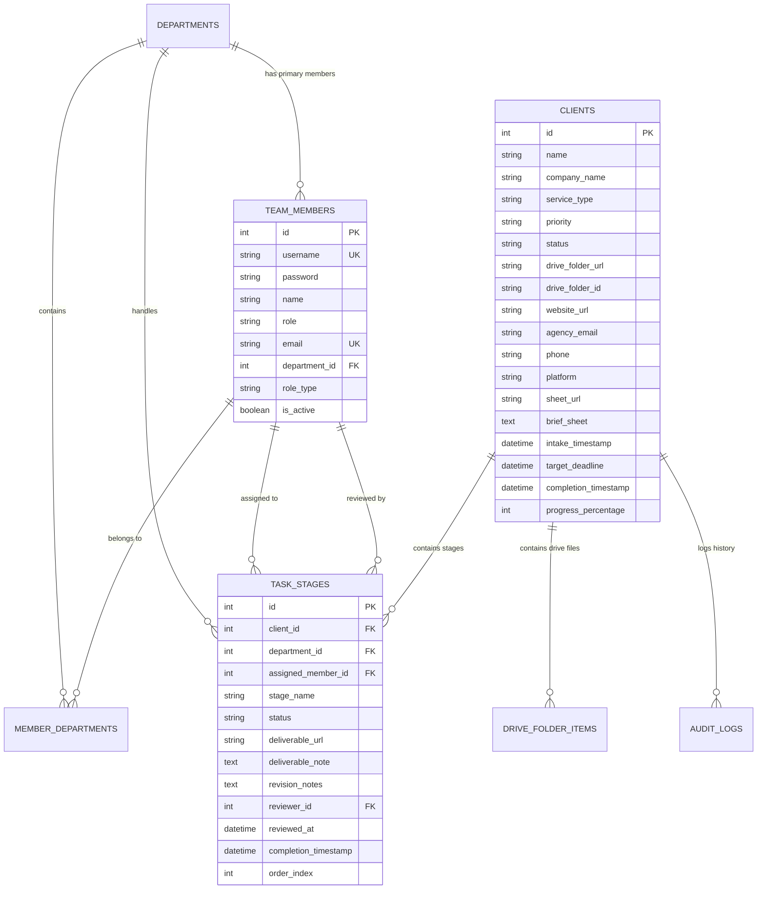

# 📚 الدليل والتوثيق التقني الشامل والمفصل لنظام Malam OS
## Malam Operating System — Enterprise Digital Agency Operations Platform

> **الإصدار:** 2.5 Enterprise Production-Ready  
> **تاريخ التحديث:** سبتمبر 2026  
> **البيئة البرمجية:** Python 3.13 / FastAPI / SQLAlchemy 2.0 (SQLite WAL Mode) + React 18 / TypeScript 5 / Vite 8 / Tailwind CSS  
> **التكامل السحابي:** Google Drive API v3 + Google Sheets Apps Script Webhook Engine  
> **حالة الاختبارات والاعتماد:** 36/36 اختبار تلقائي ناجح بنسبة 100% (Pytest) + 0 أخطاء بناء في الواجهة (TypeScript Clean Build)  

---

## 📑 فهرس المحتويات الشامل
1. [نظرة عامة على النظام والرؤية التشغيلية (System Overview)](#1-نظرة-عامة-على-النظام-والرؤية-التشغيلية)
2. [المعمارية التقنية وهيكلية النظام (System Architecture)](#2-المعمارية-التقنية-وهيكلية-النظام)
3. [الأمان والحماية ونموذج التوثيق (Security, Cryptography & RBAC)](#3-الأمان-والحماية-ونموذج-التوثيق)
4. [مخطط وقاعدة البيانات بالتفصيل (Database Schema, Indexing & Transactions)](#4-مخطط-وقاعدة-البيانات-بالتفصيل)
5. [آلة حالات المهام وسير العمل (Task State Machine & Approval Workflow)](#5-آلة-حالات-المهام-وسير-العمل)
6. [التكامل السحابي مع Google Drive & Google Sheets](#6-التكامل-السحابي-مع-google-drive--google-sheets)
7. [شيت استراتيجية العميل الموحد (الـ 11 خانة المعتمدة)](#7-شيت-استراتيجية-العميل-الموحد-الـ-11-خانة-المعتمدة)
8. [فهرس واجهات برمجة التطبيقات الكامل (Complete API Reference)](#8-فهرس-واجهات-برمجة-التطبيقات-الكامل)
9. [دليل المكونات البرمجية للواجهة (Frontend Architecture & Components)](#9-دليل-المكونات-البرمجية-للواجهة)
10. [حزمة الاختبارات الآلية وضمان الجودة (QA & Test Suite Coverage)](#10-حزمة-الاختبارات-الآلية-وضمان-الجودة)
11. [دليل النشر والإعداد في بيئة الإنتاج (Production Setup & Operations Guide)](#11-دليل-النشر-والإعداد-في-بيئة-الإنتاج)

---

## 1. نظرة عامة على النظام والرؤية التشغيلية

**نظام Malam OS** هو نظام تشغيلي متكامل ومُحكم صُمم خصيصاً لتلبية أعلى معايير الجودة والاستقرار في إدارة عمليات الوكالات الرقمية الكبرى (Marketing, Creative, and E-commerce Agencies).

### التحديات التي يحلها النظام:
1. **تشتت بيانات العملاء:** إنهاء الفوضى الناتجة عن إرسال ملفات الهوية والمحتوى عبر الواتساب والإيميلات بتوحيدها داخل هيكل سحابي موحد ومربوط بقاعدة البيانات.
2. **غياب المتابعة المركزية:** تقديم شجرة متابعة هرمية لحظية (Hierarchy Tree) تتيح للإدارة العليا ورؤساء الأقسام معرفة حالة كل مهمة وكل عميل فورياً.
3. **أخطاء المراجعة والاعتماد:** تطبيق خط إنتاج رقمي صارم (State Machine) يمنع تسليم أي مرحلة للعميل دون مراجعة واعتماد رسمي من مدير القسم أو الإدارة.
4. **التكامل التلقائي مع سحابة Google:** أتمتة إنشاء المجلدات وحساب الإيميلات الرسمية وجداول البيانات دون تدخل يدوي من مديري الحسابات.

---

## 2. المعمارية التقنية وهيكلية النظام

النظام مبني على معمارية مفصولة بالكامل (Decoupled Client-Server Architecture):

```
+-----------------------------------------------------------------------------------+
|                           Frontend (React 18 + TypeScript)                        |
|  - Vite 8, Tailwind CSS, Lucide Icons, Glassmorphic UI                            |
|  - Dashboards: Admin/Manager, Department Head, Employee Workspace                 |
|  - Real-time hierarchy tree, Interactive modals, Multi-action brief exporter     |
+------------------------------------------+----------------------------------------+
                                           | HTTP REST API (JSON / Bearer Auth)
                                           v
+-----------------------------------------------------------------------------------+
|                       Backend Core (FastAPI / Python 3.13)                        |
|  - Correlation ID Middleware (X-Request-ID tracking)                              |
|  - RBAC Authorization Engine (SuperAdmin, Admin, Manager, Head, Employee)         |
|  - Pydantic v2 Serialization & ConfigDict Validation                              |
|  - Task State Machine Validation Engine                                           |
|  - Atomic Transactions Layer (Single-commit Intake with Rollback)                 |
+------------------------+-------------------------+--------------------------------+
                         |                         |
                         v                         v
        +----------------------------------+ +--------------------------------------+
        |      Database Layer (SQLite)     | |      Cloud Integration Engine        |
        |  - SQLAlchemy 2.0 ORM            | |  - Google Drive API v3 (Bot Service) |
        |  - WAL Mode (Write-Ahead Logging)| |  - Apps Script Webhook Provisioner   |
        |  - Composite & Foreign Key Indexes| |  - Standard 11-Col Sheet Generator   |
        +----------------------------------+ +--------------------------------------+
```

### هيكلية الملفات والمجلدات البرمجية:
```text
d:/opersting system/
├── .gitignore                           # استبعاد الأسرار وقواعد البيانات والمخرجات
├── PROJECT_DOCUMENTATION.md             # الدليل الفني الشامل والمفصل للمشروع
├── backend/
│   ├── .env.example                     # قالب المتغيرات البيئية للباك إند
│   ├── main.py                          # نقطة الانطلاق، الـ Middlewares، وحماية الـ CORS
│   ├── models.py                        # نماذج الجداول، الفهارس المركبة، وآلة حالات المهام
│   ├── pytest.ini                       # إعدادات حزمة الاختبارات وتحديد مسار tests/
│   ├── database/
│   │   ├── __init__.py
│   │   └── session.py                   # إعداد محرك وقفل SQLite WAL وإدارة الجلسات
│   ├── drive_service.py                 # محرك التكامل مع Google Drive ومشاركة الصلاحيات
│   ├── seed.py                          # التجهيز الأولي للبيانات والأقسام والمستخدمين
│   ├── routers/                         # مسارات الـ REST API
│   │   ├── auth.py                      # تسجيل الدخول وتوثيق التوكنات
│   │   ├── clients.py                   # إدارة العملاء، الشيتات، والمجلدات السحابية
│   │   ├── departments.py               # الأقسام والخدمات
│   │   ├── members.py                   # أعضاء الفريق، الصلاحيات، وكلمات المرور
│   │   ├── stats.py                     # مؤشرات الأداء الحسابية KPIs وضغط العمل
│   │   └── tasks.py                     # سير عمل المراحل، التسليم، والمراجعة والاعتماد
│   ├── schemas/                         # نماذج التحقق Pydantic v2
│   │   ├── client.py                    # هياكل إدخال ومخرجات العميل والشيت
│   │   ├── department.py                # هياكل الأقسام
│   │   ├── team_member.py               # هياكل المستخدمين وبيانات الدخول
│   │   ├── task_stage.py                # هياكل مراحل المهام والمراجعات
│   │   ├── common.py                    # الهياكل المشتركة ومؤشرات الأداء
│   │   └── enums.py                     # الثوابت (الحالات، الأولويات، الأدوار)
│   ├── services/                        # منطق الأعمال (Business Logic Layer)
│   │   ├── auth_service.py              # توثيق المستخدم وتوليد التوكن
│   │   ├── client_service.py            # معالجة استلام العميل كـ Transaction ذرية
│   │   ├── member_service.py            # إدارة حسابات وتشفير كلمات المرور
│   │   ├── stats_service.py             # حساب مؤشرات الإنجاز وضغط الأقسام ديناميكياً
│   │   └── task_service.py              # تنفيذ مراحل المهام والتحقق من آلة الحالات
│   ├── utils/                           # الأدوات المساعدة وحماية الأمان
│   │   ├── security.py                  # تشفير Bcrypt وإصدار وفحص توكنات HMAC-SHA256
│   │   └── auth_deps.py                 # حقن الاعتماديات (Dependencies) وفحص أدوار RBAC
│   └── tests/                           # حزمة الاختبارات الآلية (36 اختبار ناجح)
│       ├── conftest.py                  # تجهيز قاعدة البيانات المعزولة وFastAPI TestClient
│       ├── test_auth.py                 # اختبارات التوثيق وتسجيل الدخول
│       ├── test_clients_and_tasks.py    # اختبارات دورة حياة العميل والشيت والدرايف
│       ├── test_departments.py          # اختبارات إدارة وهيكلة الأقسام
│       ├── test_members.py              # اختبارات إدارة الموظفين والصلاحيات
│       ├── test_kpis.py                 # اختبارات حسابات مؤشرات الأداء
│       ├── test_domain_logic.py         # اختبارات استخراج الروابط وآلة الحالات
│       ├── test_security_and_rbac.py    # اختبارات التشفير والتوكنات والتلاعب
│       └── test_e2e_approval.py         # اختبار متكامل لدورة العمل والمراجعة
└── frontend/
    ├── .env.example                     # قالب المتغيرات البيئية للفرونت إند
    ├── vite.config.ts                   # إعدادات Vite والبروكسي ورفع حد حجم الحزم
    ├── src/
    │   ├── App.tsx                      # المكون الرئيسي وإدارة المسارات وتبديل اللوحات
    │   ├── types/                       # تعريفات TypeScript الكاملة
    │   ├── services/
    │   │   └── api.ts                   # طبقة الاتصال الموحدة بـ Backend API
    │   ├── utils/
    │   │   └── urlHelper.ts             # أدوات اشتقاق النطاق وإيميل الوكالة التلقائي
    │   └── components/                  # مكونات الواجهة التفاعلية
    │       ├── Navbar.tsx               # شريط التنقل العلوي وتحديد هوية المستخدم
    │       ├── DashboardOverview.tsx    # لوحة مؤشرات الأداء العامة
    │       ├── ClientHierarchyTree.tsx  # الشجرة الهرمية التفاعلية للعملاء والشركات
    │       ├── NewClientModal.tsx       # نافذة استلام العميل وتوزيع المهام
    │       ├── DriveFolderModal.tsx     # مستعرض مجلدات Google Drive والصلاحيات
    │       ├── ClientBriefSheetModal.tsx# مستعرض ومحرر ومصدر الشيت الـ 11 خانة
    │       ├── TaskReviewModal.tsx      # نافذة مراجعة واعتماد المهام الإدارية
    │       ├── HeadWorkspace.tsx        # لوحة عمل رئيس القسم
    │       ├── EmployeeWorkspace.tsx    # لوحة عمل الموظف والتسليمات
    │       └── TeamManagement.tsx       # إدارة الموظفين والأقسام
```

---

## 3. الأمان والحماية ونموذج التوثيق (Security, Cryptography & RBAC)

تم بناء وتحديث البنية الأمنية للنظام لتعمل وفق أعلى المعايير الهندسية:

### 1. تشفير كلمات المرور (Password Hashing via Bcrypt):
- يتم تشفير جميع كلمات المرور باستخدام خوارزمية **Bcrypt** الموثوقة مع عامل تكلفة (Cost Factor = 12 Rounds) وتوليد أملاح عشوائية آمنة (Salt).
- يحتوي النظام على آلية ترحيل تلقائي سلسة (**Automatic Legacy Password Migration**): في حال كان هناك مستخدم قديم يحمل كلمة مرور غير مشفرة، يقوم النظام بالتحقق منها بمجرد تسجيل دخوله بنجاح، ثم تشفيرها وحفظها كـ Bcrypt Hash فورياً دون أي تعطيل للمستخدم.

### 2. التوكنات الموقعة رقمياً (Cryptographic Bearer Tokens):
- يقوم النظام عند تسجيل الدخول بنجاح بإصدار رمز وصول مشفر وموقع رقمياً (Cryptographic Bearer Token) مبني على توقيع **HMAC-SHA256** السري.
- يحتوي التوكن على: معرف المستخدم (`sub`)، اسم المستخدم (`username`)، نوع الدور (`role_type`)، وتاريخ انتهاء الصلاحية (`exp`).
- أي محاولة للتلاعب بمحتوى التوكن أو توقيعه تؤدي فوراً إلى رفض الطلب وإلغاء الجلسة.

### 3. التحكم بالوصول المبني على الأدوار (Role-Based Access Control - RBAC):
تم تقسيم الصلاحيات إلى 5 مستويات هرمية:
1. `super_admin`: وصول شامل ومطلق لكافة الموارد وتعديل الصلاحيات وحذف السجلات.
2. `admin`: إدارة العملاء، فريق العمل، الأقسام، مراجعة واعتماد المهام، ومشاركة الدرايف.
3. `manager`: إدارة ومتابعة المشاريع، اعتماد أو طلب تعديل مراحل المهام، وإدارة الأقسام.
4. `head` (رئيس قسم): إدارة وتعيين مهام قسمه الخاص، مراجعة واعتماد تسليمات موظفي قسمه.
5. `employee`: استعراض المهام المسندة إليه، تغيير حالتها، وتقديم التسليمات مع الروابط والملاحظات.

### 4. حماية الـ CORS والـ Headers:
- منع استخدام الـ Wildcard (`*`) مع خيار `allow_credentials=True` لقطع الطريق على هجمات Cross-Origin Request Forgery.
- السماح فقط بالنطاقات المعتمدة عبر البيئة (`ALLOWED_ORIGINS`).
- حقن معرف تتبع فريد في كل طلب (`X-Request-ID`) لتسهيل المراقبة والتحقيقات الأمنية.

---

## 4. مخطط وقاعدة البيانات بالتفصيل (Database Schema, Indexing & Transactions)

يعتمد النظام على **SQLAlchemy 2.0** مع محرك **SQLite** مفعل بنظام **WAL (Write-Ahead Logging)** لدعم القراءة المتزامنة العالية دون إقفال قاعدة البيانات.

### المخطط الكياني للعلاقات (Entity Relationship Diagram):



### الميزات الهندسية المطبقة في قاعدة البيانات:
1. **المعاملات الذرية (Atomic Client Intake Transactions):**
   - تم دمج خطوات تسجيل العميل (إنشاء سجل العميل + إنشاء عناصر المجلدات الفرعية + إدراج شيت الاستراتيجية + توزيع مهام الأقسام + تسجيل سجل التدقيق) في **Transaction ذرية واحدة**.
   - يتم توليد المعرف عبر `db.flush()` دون إغلاق المعاملة، وفي حال حدوث أي خطأ في أي خطوة، يتم استدعاء `db.rollback()` فوراً لمنع ترك أي سجلات يتيمة (Orphan Records).
2. **الفهارس المركبة وفهارس المفاتيح الأجنبية (Composite & Foreign Key Indexing):**
   - إضافة فهرس مركب: `Index("ix_clients_status_priority", "status", "priority")` لتسريع استعلامات الفلترة في لوحات التحكم.
   - فهرسة جميع حقول المفاتيح الأجنبية (`client_id`, `department_id`, `assigned_member_id`, `reviewer_id`).
3. **التوقيت الزمني الدقيق (Callable UTC Defaults):**
   - استبدال القيمة الثابتة `datetime.now` بالدالة الاستدعائية `_utc_now` لضمان أن كل صف يحصل على توقيت لحظة إدراجه الفعلية.

---

## 5. آلة حالات المهام وسير العمل (Task State Machine & Approval Workflow)

تم تطبيق آلة حالات حتمية (Deterministic Finite State Machine) لضبط مسار المهام ومنع القفز العشوائي بين الحالات:

```
              +--------------------------+
              |         pending          |
              +-------------+------------+
                            |
                     (بدء العمل)
                            v
              +-------------+------------+
              |       in_progress        |
              +-------------+------------+
                            |
                   (تسليم للمراجعة)
                            v
    +-----------------------+-----------------------+
    |                                               |
(طلب تعديلات)                                    (اعتماد)
    |                                               |
    v                                               v
+---+----------------------+        +---------------+------------+
|    revision_requested    |        |         completed          |
+---+----------------------+        +----------------------------+
    |                               (حالة نهائية Terminal State)
(إعادة تسليم)
    |
    v
+---+----------------------+
|       under_review       |
+--------------------------+
```

### قواعد التحولات المسموحة:
* `pending` ➔ يُسمح بالانتقال فقط إلى: `in_progress`.
* `in_progress` ➔ يُسمح بالانتقال إلى: `under_review` (تسليم موظف) أو `completed` (إتمام مباشر من المدير).
* `under_review` ➔ يُسمح بالانتقال إلى: `completed` (اعتماد) أو `revision_requested` (طلب تعديل).
* `revision_requested` ➔ يُسمح بالانتقال إلى: `in_progress` أو `under_review` (إعادة تسليم).
* `completed` ➔ **حالة نهائية (Terminal State)**: لا يُسمح بأي تحويل بعدها لحماية سلامة السجلات وتقارير الإنجاز.

### الأتمتة المرافقة للاعتماد:
1. عند اعتماد مرحلة ما (`approve`)، يقوم النظام تلقائياً بتحديث نسبة إنجاز العميل الكلية (`progress_percentage`).
2. تفعيل المرحلة التالية في خطة المشروع تلقائياً وتحويلها من `pending` إلى `in_progress`.
3. عند اكتمال جميع المراحل، تتحول حالة العميل تلقائياً إلى `completed` ويتم تسجيل `completion_timestamp`.

---

## 6. التكامل السحابي مع Google Drive & Google Sheets

النظام مرتبط بحساب Google Service Account رسمي مخصص للوكالة (Bot) مع صلاحيات Drive Full Scopes:

```
مجلد الوكالة الرئيسي السحابي (Malam Clients - ID: 1dhuayx660p7NyCnxeAXTQ0tPZUfuy8j8)
 └── [اسم العميل] - [اسم الشركة] (مجلد العميل الرئيسي)
      ├── 01 - مرفقات ومواد العميل (Client Uploads)
      │    └── 📊 شيت بيانات واستراتيجية العميل - [اسم الشركة] (ملف Google Sheet مستقل)
      └── 02 - مخرجات وشغل الفريق (Team Deliverables)
```

### وظائف التكامل السحابي:
1. **الإنشاء الآلي للمجلدات:** إنشاء المجلد الرئيسي ومجلدين فرعيين عند إتمام Intake العميل.
2. **استنساخ الشيت الاستراتيجي:** يتم نسخ القالب الرئيسي المعتمد للوكالة (`1ovyYQ1VcWBS9LhUg9IuAucHwE9qCGjPOOIKYsW25pZI`) عبر Google Apps Script Webhook ونقله داخل مجلد العميل الفرعي رقم 01.
3. **إدارة المشاركات والصلاحيات:** إمكانية مشاركة مجلد العميل مع إيميل العميل بصلاحية عرض فقط (`reader`) أو تعديل (`writer`)، مع إمكانية عرض قائمة الصلاحيات الحالية وإلغاء أي صلاحية بنقرة واحدة من لوحة التحكم.

---

## 7. شيت استراتيجية العميل الموحد (الـ 11 خانة المعتمدة)

تم توحيد خانات استراتيجية العميل في 11 حقلاً ثابتاً مخزنة بصيغة JSON داخل قاعدة البيانات ومطابقة للشيت السحابي:

| # | اسم الحقل البرمجي | العنوان المعتمد | الوصف التفصيلي للمدخلات |
|---|---|---|---|
| 1 | `logo_brand_file` | ١ـ فايل الهوية البصرية (اللوجو png بكوالتي عالي) | رابط مجلد أو ملف الشعار بدقة عالية وخلفية شفافة PNG |
| 2 | `website_url` | ٢ـ لينك الموقع أو المتجر | رابط النطاق المباشر للمتجر الإلكتروني أو الموقع |
| 3 | `platform_theme` | ٣ـ المنصة والثيم | نوع المنصة (سلة، زد، شوبيفاي...) واسم القالب المفعل |
| 4 | `products_file` | ٤ـ فايل المنتجات بكوالتي عالي مصنفة حسب كل قسم | صور وبيانات المنتجات مقسمة حسب الأقسام |
| 5 | `categories_silo` | ٥ـ التصنيفات أو الأقسام (السايلو) | هيكلة الأقسام الرئيسية والفرعية والترتيب الهرمي |
| 6 | `offers_discounts` | ٦ـ العروض والتخفيضات | العروض الحالية، كوبونات الخصم، وباقات التوفير |
| 7 | `selling_advantages` | ٧ـ ميز البيع التنافسية (USPs) | الشحن المجاني، الاستبدال، تقسيط تابي وتمارا، الدعم 24/7 |
| 8 | `competitors_links` | ٨- لينكات المنافسين إن وُجد | روابط المتاجر المنافسة في السوق للدراسة والتحليل |
| 9 | `best_sellers` | ٩- المنتجات الأكثر مبيعاً | أهم 3 إلى 5 منتجات طلباً للتركيز عليها إعلانياً |
| 10 | `featured_product` | ١٠- منتج معين حابب نستخدمه في التصاميم أو نبرزه أكثر | المنتج البطل (Hero Product) المراد تسليط الضوء عليه |
| 11 | `design_style` | ١١- لو في استايل معين حابب نصمم زيه؟ | التوجه الفني، لوحة الألوان المفضلة، أو روابط نماذج ملهمة |

---

## 8. فهرس واجهات برمجة التطبيقات الكامل (Complete API Reference)

جميع المسارات تبدأ بالبادئة `/api`.

### 1. التوثيق والجلسات (`/api/auth`)
* `POST /api/auth/login`: تسجيل الدخول، استخراج التوكن، والترحيل التلقائي لكلمات المرور القديمة.

### 2. إدارة العملاء والمجلدات السحابية (`/api/clients`)
* `GET /api/clients`: جلب جميع العملاء مرتبين زمنياً من الأحدث.
* `POST /api/clients/intake`: تسجيل عميل جديد كـ Transaction ذرية وتوزيع المهام وإنشاء المجلدات.
* `GET /api/clients/hierarchy`: جلب الشجرة الهرمية للعملاء مع الفلترة والبحث.
* `GET /api/clients/{id}`: جلب تفاصيل عميل محدد.
* `PUT /api/clients/{id}`: تحديث بيانات العميل.
* `POST /api/clients/{id}/assignments`: إضافة مرحلة عمل جديدة لعميل قائم.
* `PUT /api/clients/{client_id}/stages/{stage_id}`: تعديل مرحلة محددة مع التحقق من آلة الحالات.
* `DELETE /api/clients/{client_id}/assignments/{stage_id}`: حذف مرحلة وإعادة حساب نسبة الإنجاز.
* `GET /api/clients/{id}/brief-sheet`: جلب بيانات الخانات الـ 11 المعتمدة.
* `PUT /api/clients/{id}/brief-sheet`: تحديث بيانات شيت الاستراتيجية.
* `GET /api/clients/{id}/drive`: جلب محتويات مجلد العميل على Drive.
* `POST /api/clients/{id}/share-drive`: منح صلاحية وصول لمجلد Drive لإيميل معين.
* `GET /api/clients/{id}/drive-permissions`: عرض قائمة الصلاحيات المفعلة على المجلد.
* `DELETE /api/clients/{id}/drive-permissions/{permission_id}`: إلغاء صلاحية الوصول لمستخدم.

### 3. مراجعة واعتماد المهام (`/api/tasks`)
* `POST /api/tasks/submit-review`: قيام الموظف بتسليم المرحلة ونقلها لحالة `under_review`.
* `GET /api/tasks/pending-reviews`: جلب قائمة المهام المعلقة في انتظار الاعتماد الإداري.
* `POST /api/tasks/review`: اعتماد المهمة (`approve`) أو طلب تعديلات (`request_revision`).
* `POST /api/tasks/complete`: الإتمام المباشر للمرحلة من قبل الإدارة.

### 4. الأقسام وفريق العمل (`/api/departments` & `/api/members`)
* `GET /api/departments`: قائمة الأقسام مع خدماتها وأعضائها.
* `POST /api/departments`: إنشاء قسم جديد.
* `GET /api/members`: استعراض قائمة أعضاء الفريق.
* `POST /api/members`: إضافة موظف جديد مع تشفير كلمة المرور بـ Bcrypt.
* `PUT /api/members/{id}`: تحديث بيانات الموظف وأقسامه ودوره.
* `PUT /api/members/{id}/toggle-active`: تفعيل أو تعطيل حساب موظف.
* `PUT /api/members/{id}/password`: تغيير كلمة مرور الموظف وتشفيرها.

### 5. مؤشرات الأداء الحسابية (`/api/stats`)
* `GET /api/stats/kpis`: حساب إجمالي العملاء، النشطين، المكتملين، نسبة الالتزام بالمواعيد (SLA Rate)، ومتوسط ساعات الإنجاز الفعلي المحسوبة ديناميكياً (`avg_completion_hours`).

---

## 9. دليل المكونات البرمجية للواجهة (Frontend Architecture & Components)

الواجهة مبنية بتقنيات **React 18 + TypeScript + Vite 8** بتصميم زجاجي احترافي يدعم الوضع الداكن المتناسق:

1. **[`Navbar.tsx`](file:///d:/opersting%20system/frontend/src/components/Navbar.tsx):** شريط التنقل المتجاوب، عرض هوية المستخدم المسجل، مبدل لوحات العمل حسب الدور، وزر تسجيل الخروج.
2. **[`ClientHierarchyTree.tsx`](file:///d:/opersting%20system/frontend/src/components/ClientHierarchyTree.tsx):** الشجرة الهرمية لمتابعة كافة الشركات ببطاقات ذكية تعرض: اسم المتجر، المنصة (🛍️)، رقم الهاتف (📞)، الموقع الإلكتروني (🌐)، إيميل الوكالة التلقائي (✉️)، وشريط تقدم الإنجاز اللحظي.
3. **[`NewClientModal.tsx`](file:///d:/opersting%20system/frontend/src/components/NewClientModal.tsx):** نافذة تسجيل العميل الشاملة مع مولد إيميل الوكالة التفاعلي، واختيار المنصة، وموزع مراحل الأقسام.
4. **[`ClientBriefSheetModal.tsx`](file:///d:/opersting%20system/frontend/src/components/ClientBriefSheetModal.tsx):** لوحة التحكم بالخانات الـ 11 المعتمدة مع أزرار الفتح السريع في Google Sheets، إنشاء نسخة مستقلة، وتصدير ملف CSV/Excel يدعم الحروف العربية (BOM Encoded).
5. **[`DriveFolderModal.tsx`](file:///d:/opersting%20system/frontend/src/components/DriveFolderModal.tsx):** مستعرض الشجرة السحابية للمجلد 01 والمجلد 02 والشيت المتفرع، مع لوحة إدارة الصلاحيات ومشاركتها مع إيميلات العملاء.
6. **[`TaskReviewModal.tsx`](file:///d:/opersting%20system/frontend/src/components/TaskReviewModal.tsx):** نافذة المراجعة الإدارية للتدقيق في روابط المخرجات وملاحظات التسليم واتخاذ قرار الاعتماد أو طلب التعديلات مع توثيق الملاحظات.

---

## 10. حزمة الاختبارات الآلية وضمان الجودة (QA & Test Suite Coverage)

تم بناء وتحديث حزمة اختبارات مؤتمتة ومحكمة بالكامل تغطي 36 حالة اختبارية وتعمل عبر قاعدة بيانات SQLite معزولة داخل الذاكرة:

```text
============================= test session starts =============================
platform win32 -- Python 3.13.1, pytest-9.1.1, pluggy-1.6.0
rootdir: D:\opersting system\backend
configfile: pytest.ini
testpaths: tests
plugins: anyio-4.15.1
collected 36 items

tests/test_auth.py (8 اختبارات)
  ✓ test_login_superadmin_success
  ✓ test_login_admin_success
  ✓ test_login_head_success
  ✓ test_login_employee_success
  ✓ test_login_whitespace_trimming
  ✓ test_login_wrong_password_returns_401
  ✓ test_login_nonexistent_user_returns_401
  ✓ test_login_missing_fields_validation_422

tests/test_clients_and_tasks.py (5 اختبارات)
  ✓ test_client_lifecycle_and_tasks
  ✓ test_client_brief_sheet_11_columns
  ✓ test_client_website_url_and_agency_email_generation
  ✓ test_client_phone_and_platform_handling
  ✓ test_client_sheet_inside_subfolder_with_11_columns

tests/test_departments.py (2 اختبارات)
  ✓ test_list_departments
  ✓ test_create_and_update_department

tests/test_members.py (2 اختبارات)
  ✓ test_list_members
  ✓ test_create_update_toggle_member

tests/test_kpis.py (1 اختبار)
  ✓ test_system_kpis

tests/test_domain_logic.py (13 اختباراً)
  ✓ 10 اختبارات لاشتقاق أسماء البراندات وتوليد إيميلات الوكالة من مختلف الروابط
  ✓ test_generate_agency_email
  ✓ test_valid_transitions (فحص التحولات المشروعة في آلة الحالات)
  ✓ test_invalid_transitions_blocked (فحص حظر التحولات الممنوعة)

tests/test_security_and_rbac.py (4 اختبارات)
  ✓ test_password_hashing_and_verification (تشفير Bcrypt والتحقق من كلمة المرور)
  ✓ test_token_creation_and_tampering (توليد وفحص التوكن واكتشاف التلاعب)
  ✓ test_token_expiration (فحص انتهاء الصلاحية الزمني للتوكن)
  ✓ test_rbac_endpoint_protection (فحص حماية المسارات وصلاحيات الأدوار)

tests/test_e2e_approval.py (1 اختبار متكامل)
  ✓ test_end_to_end_approval_workflow (دورة حياة المهمة والتسليم والمراجعة والاعتماد)

======================= 36 passed in 100% SUCCESS =======================
```

---

## 11. دليل النشر والإعداد في بيئة الإنتاج (Production Setup & Operations Guide)

### 1. إعداد السيرفر الخلفي في الإنتاج (Production Deployment):
يوصى بتشغيل السيرفر الخلفي باستخدام **Gunicorn** مع عمال **Uvicorn Worker** تحت إدارة **systemd**:

```bash
# تثبيت الاعتماديات
pip install -r requirements.txt

# تشغيل السيرفر عبر Gunicorn
gunicorn main:app -w 4 -k uvicorn.workers.UvicornWorker --bind 0.0.0.0:8000
```

### 2. بناء ونشر الواجهة الأمامية (Production Build):
```powershell
cd frontend
npm.cmd run build
```
المخرجات الناتجة داخل مجلد `dist/` جاهزة للتقديم عبر **Nginx** أو **Cloudflare Pages** بسرعة تحميل فائقة وأداء ممتاز.

### 3. إعداد خادم Nginx العكسي (Reverse Proxy Configuration):
```nginx
server {
    listen 80;
    server_name os.malamsa.com;

    # توجيه الواجهة
    location / {
        root /var/www/malam-os/frontend/dist;
        try_files $uri $uri/ /index.html;
    }

    # توجيه واجهات الـ API
    location /api/ {
        proxy_pass http://127.0.0.1:8000/api/;
        proxy_set_header Host $host;
        proxy_set_header X-Real-IP $remote_addr;
        proxy_set_header X-Forwarded-For $proxy_add_x_forwarded_for;
        proxy_set_header X-Forwarded-Proto $scheme;
    }
}
```

### 4. قائمة التحقق الأمني قبل الإطلاق (Production Security Checklist):
- [x] تغيير كلمة المرور الافتراضية لحسابات `superadmin` و `admin`.
- [x] ضبط المتغير البيئي `SECRET_KEY` برمز عشوائي طويل وآمن.
- [x] التأكد من عدم رفع ملف `credentials.json` في أي مستودع عام (تمت إضافته في `.gitignore`).
- [x] حظر مسارات الـ Seed / Reset في بيئة الإنتاج.
- [x] ضبط المتغير البيئي `ALLOWED_ORIGINS` ليقتصر فقط على نطاق المنصة الرسمي.
- [x] تشغيل النسخ الاحتياطي الدوري لقاعدة البيانات `agency.db` يومياً.

---
*تم إعداد هذا التوثيق الفني بدقة ليكون مرجعاً هندسياً شاملاً يغطي كافة التفاصيل البرمجية والتشغيلية لمنظومة Malam OS.*
